# 🥭🍭 Mango Lollipop — Lifecycle Messaging Architecture

**AI-powered lifecycle messaging generator for SaaS companies**

*A Claude Code skills-based tool that analyzes your business, generates a complete lifecycle messaging matrix using the AARRR framework, produces full message copy in your brand voice, and outputs everything as production-ready deliverables.*

---

## 1. What Mango Lollipop Does

Mango Lollipop takes a SaaS company from "we know we need lifecycle messaging" to "here's a complete, ready-to-implement messaging system" in a single session. It works entirely through Claude Code — no hosted services, no accounts, no SaaS dependencies.

It serves two types of users:
- **Starting fresh:** No lifecycle messaging in place. Mango Lollipop builds everything from scratch.
- **Improving existing:** Has messages running but needs to fill gaps, fix problems, or level up. Mango Lollipop audits what they have and builds on top of it.

**Inputs:**
- Description of your product, audience, and key features
- 2-5 sample messages (pasted) for voice/style matching
- Your event taxonomy (or Mango Lollipop infers it from your product type)
- Channel preferences (which channels you use or plan to use)
- Optional: existing messages, performance stats, or documentation to audit

**Outputs:**
- `matrix.xlsx` — Full lifecycle matrix spreadsheet (the source of truth)
- `dashboard.html` — Interactive visual dashboard with Mermaid journey maps
- `overview.html` — Executive summary (printable, shareable)
- `messages/` — Individual message files organized by stage (markdown)
- `mango-lollipop.json` — Machine-readable project config for iteration

---

## 2. Core Concepts

### 2.1 The AARRR Lifecycle Framework

Every message in Mango Lollipop maps to a pirate metrics stage:

| Stage | Code | Purpose | Example Triggers |
|-------|------|---------|-----------------|
| **Acquisition** | `AQ` | Get them signed up and verified | Signup, email verification, SSO connect |
| **Activation** | `AC` | Drive to "aha moment" | First feature use, onboarding steps, setup completion |
| **Revenue** | `RV` | Convert free → paid, expand | Trial ending, usage limits, upgrade prompts |
| **Retention** | `RT` | Keep them engaged and coming back | Usage recaps, feature announcements, re-engagement |
| **Referral** | `RF` | Turn users into advocates | Invite prompts, milestone celebrations, NPS |

### 2.2 Message Classification: Transactional vs. Lifecycle

All messages fall into one of two categories. This distinction matters because they have different legal requirements (CAN-SPAM, GDPR), different deliverability profiles, and are typically handled by different systems.

| | **Transactional** | **Lifecycle (Marketing)** |
|---|---|---|
| **Purpose** | Required for product function | Drives engagement/conversion |
| **Unsubscribe** | Not required (user expects them) | Required by law |
| **Examples** | Email verification, password reset, receipt, usage alert | Welcome drip, feature tips, re-engagement, trial ending |
| **Timing** | Always instant, triggered by user action | Scheduled, delayed, or behavioral |
| **Opt-out** | Cannot opt out | Must be able to opt out |
| **Code prefix** | `TX-` | Stage prefix (`AQ-`, `AC-`, etc.) |

In the matrix, transactional messages live in their own section and are always generated — they're non-negotiable. Lifecycle messages are where the strategy and creativity live.

### 2.3 Tags

Tags provide flexible cross-cutting categorization beyond AARRR stages. They let you filter, segment, and organize messages by any dimension.

**Built-in tag categories:**

| Category | Example Tags | Purpose |
|----------|-------------|---------|
| `type:` | `promotional`, `educational`, `behavioral`, `transactional` | Message intent classification |
| `source:` | `coupon`, `partner:stripe`, `partner:hubspot`, `organic`, `referral` | How the user was acquired |
| `plan:` | `free`, `trial`, `pro`, `enterprise` | Current subscription tier |
| `segment:` | `power-user`, `dormant`, `new`, `churning` | Behavioral segment |
| `feature:` | `agenda`, `polls`, `integrations`, `breakouts` | Which feature is being promoted |
| `priority:` | `critical`, `high`, `normal`, `low` | Send priority |

Tags are freeform strings — users can create any tag they want. The categories above are suggestions that the `start` skill recommends based on the business.

### 2.4 Message Anatomy

Each message in the matrix has these properties:

```typescript
interface Message {
  // Identity
  id: string;                    // e.g., "AC-03" or "TX-02"
  stage: AARRRStage | "TX";     // AARRR stage or transactional
  name: string;                  // Human-readable name
  classification: "transactional" | "lifecycle";

  // Trigger & Timing (industry-standard model)
  trigger: Trigger;              // What event initiates this message
  wait: string;                  // ISO 8601 duration: "P0D" (instant), "PT5M" (5min), "P2D" (2 days)
  guards: Guard[];               // Conditions that must be TRUE to send
  suppressions: Suppression[];   // Conditions that CANCEL sending (even after trigger)
  
  // Content
  subject: string;               // Email subject / notification title
  preheader?: string;            // Email preheader text
  body: string;                  // Full message copy (markdown)
  cta: CTA;                     // Primary call-to-action
  
  // Delivery
  channels: Channel[];           // Which channels to deliver on
  format: "plain" | "rich";     // Plain text vs HTML/rich
  from: string;                  // Sender persona (e.g., "Jakob, CEO")
  
  // Targeting
  segment: string;               // Who receives this
  tags: string[];                // Flexible categorization tags
  
  // Meta
  goal: string;                  // What metric this drives
  comments: string;              // Implementation notes
}

type Channel = "email" | "sms" | "in-app" | "push";
type AARRRStage = "AQ" | "AC" | "RV" | "RT" | "RF";

// --- Trigger & Timing Model ---
// Modeled after Customer.io / Braze / Iterable patterns

interface Trigger {
  event: string;                 // The event that starts the clock
                                 // e.g., "user.signed_up", "trial.started"
  type: "event" | "scheduled" | "behavioral";
                                 // event = fires on specific event
                                 // scheduled = fires on a schedule (cron-like)
                                 // behavioral = fires on pattern (e.g., inactivity)
  schedule?: string;             // For scheduled: "every friday 9am" or cron
}

// Wait duration uses ISO 8601 durations:
// P0D = instant (no wait)
// PT5M = 5 minutes
// PT2H = 2 hours
// P1D = 1 day
// P3D = 3 days
// P2W = 2 weeks

interface Guard {
  // Must be TRUE for the message to send.
  // All guards must pass (AND logic).
  condition: string;             // Human-readable condition
  expression: string;            // Machine-readable expression
                                 // e.g., "user.email_verified == true"
                                 // e.g., "user.plan == 'free'"
}

interface Suppression {
  // If TRUE, the message is cancelled even if trigger fired and guards passed.
  // Any suppression match cancels (OR logic).
  condition: string;             // Human-readable
  expression: string;            // e.g., "user.unsubscribed == true"
                                 // e.g., "feature.agenda_used == true"
                                 // e.g., "message.AC-02.sent_at < 24h_ago"
}

interface CTA {
  text: string;                  // Button/link text
  url?: string;                  // Deep link or URL pattern
}
```

**Why this model instead of "Delay" and "Not Sent If":**

The old model (`delay: "3 days"`, `notSentConditions: [...]`) conflates several distinct concerns. The industry-standard approach used by Customer.io, Braze, and Iterable separates them:

| Old Model | New Model | Why It's Better |
|-----------|-----------|-----------------|
| `delay: "3 days"` | `trigger.event` + `wait: "P3D"` | Separates *what starts the clock* from *how long to wait*. "3 days after what?" is now unambiguous. |
| `notSentConditions` | `guards[]` + `suppressions[]` | Separates *prerequisites* (guards: "only send to free users") from *cancellation* (suppression: "don't send if they already used the feature"). Guards are AND logic, suppressions are OR logic. |
| (implicit) | `trigger.type` | Makes it explicit whether this fires on an event, on a schedule, or on a behavioral pattern (like inactivity). |

### 2.5 Event Taxonomy

Rather than integrating with Mixpanel/Segment (auth hassle, onboarding drop-off), Mango Lollipop infers a likely event taxonomy based on your product type, then lets you customize.

**Default SaaS event taxonomy template:**

```yaml
identity:
  - user.signed_up
  - user.email_verified
  - user.profile_completed
  - user.invited_teammate

activation:
  - feature.{key_feature}_used_first_time
  - onboarding.step_completed
  - onboarding.completed
  - project.created
  - project.completed

engagement:
  - session.started
  - feature.{feature_name}_used
  - content.shared
  - collaboration.started

conversion:
  - trial.started
  - trial.ending_soon        # 3 days before
  - trial.expired
  - subscription.created
  - subscription.upgraded
  - subscription.downgraded
  - subscription.cancelled

retention:
  - user.inactive_3_days
  - user.inactive_7_days
  - user.inactive_14_days
  - usage.weekly_summary
  - milestone.reached
```

---

## 3. Project Structure

```
mango-lollipop/
├── README.md                        # Project overview + quickstart
├── package.json                     # CLI entry point
├── bin/
│   └── mango-lollipop.js           # CLI dispatcher
│
├── skills/                          # Claude Code skills (the brain)
│   ├── start/
│   │   └── SKILL.md                 # Analyze business + existing messages
│   ├── generate-matrix/
│   │   └── SKILL.md                 # Generate the lifecycle matrix
│   ├── generate-messages/
│   │   └── SKILL.md                 # Write full message copy
│   ├── generate-dashboard/
│   │   └── SKILL.md                 # Create journey maps + dashboard
│   ├── audit/
│   │   └── SKILL.md                 # Audit existing lifecycle messaging
│   ├── dev-handoff/
│   │   └── SKILL.md                 # Developer hand-off documents
│   └── iterate/
│       └── SKILL.md                 # Modify matrix based on feedback
│
├── templates/                       # Output templates
│   ├── dashboard.html               # Interactive dashboard template
│   ├── overview.html                # Executive summary template
│   ├── saas-matrix.json             # Default SaaS matrix template
│   └── events/
│       ├── saas-general.yaml        # Generic SaaS events
│       ├── saas-collaboration.yaml  # Collaboration tools (like Butter)
│       ├── saas-document.yaml       # Document tools (like PandaDoc)
│       └── saas-marketplace.yaml    # Marketplace/platform events
│
├── lib/                             # Shared utilities
│   ├── schema.ts                    # TypeScript types + validation
│   ├── excel.ts                     # Excel generation (xlsx)
│   ├── mermaid.ts                   # Mermaid diagram generation
│   └── html.ts                      # HTML dashboard + overview generation
│
└── output/                          # Generated per-project (gitignored)
    └── {project-name}/
        ├── mango-lollipop.json      # Project config
        ├── matrix.xlsx              # The matrix spreadsheet
        ├── dashboard.html           # Interactive dashboard
        ├── overview.html            # Executive summary
        ├── journey.mermaid          # Journey map source
        └── messages/
            ├── TX/                  # Transactional messages
            │   ├── TX-01-verify-email.md
            │   ├── TX-02-password-reset.md
            │   └── TX-03-receipt.md
            ├── AQ/                  # Acquisition
            │   ├── AQ-01-welcome.md
            │   └── AQ-02-getting-started.md
            ├── AC/                  # Activation
            │   ├── AC-01-feature-agenda.md
            │   ├── AC-02-feature-polls.md
            │   └── ...
            ├── RV/                  # Revenue
            │   ├── RV-01-trial-ending.md
            │   └── ...
            ├── RT/                  # Retention
            │   ├── RT-01-weekly-recap.md
            │   └── ...
            └── RF/                  # Referral
                ├── RF-01-invite-team.md
                └── ...
```

---

## 4. Claude Code Skills Design

### 4.1 Skill: `start` — Understand the Business

**Purpose:** Gather everything needed to generate a great matrix. Routes into one of two paths based on whether the user has existing messaging or is starting fresh.

**SKILL.md core prompt structure:**

```markdown
# Analyze Business for Lifecycle Messaging

You are a lifecycle marketing strategist analyzing a SaaS business.

## Step 0: Determine User Path

Ask the user: "Are you building lifecycle messaging from scratch, or do 
you have existing messages you want to improve?"

### PATH A: Starting Fresh
→ Go to Step 1 (Product Understanding)

### PATH B: Improving Existing
→ Go to Step 1 (Product Understanding), then continue to Step 5 
  (Existing System Audit) which is the deep-dive for this path.

## Step 1: Product Understanding
Ask about the product, audience, key features, pricing model, and 
what the "aha moment" is for new users.

The user may:
- Describe it in natural language (conversation)
- Upload a document (product brief, pitch deck, PRD, etc.)

If they upload a document, parse it and extract the relevant information.
Confirm your understanding before proceeding.

## Step 2: Channel Preferences
Ask: "Which messaging channels do you currently use or plan to use?"
Present options: Email, SMS, In-app messages, Push notifications

Only generate messages for channels they select. This prevents producing
output they can't implement.

## Step 3: Voice Sampling
Ask: "Paste 2-5 examples of messages you've sent to users — emails, 
in-app messages, anything. I'll match your voice and style."

If they don't have samples, ask them to describe their desired tone 
(formal/casual, emoji usage, signature style) and provide a short 
writing sample on any topic.

## Step 4: Event Discovery
Based on the product type, propose an event taxonomy. Let them confirm 
or adjust.

## Step 5: Existing System Audit (PATH B only)
This is the deep-dive for users who have existing messaging. Ask:

### 5a. Current Setup Description
"Describe your current lifecycle messaging setup. You can:
  - Paste your messages or their subjects/descriptions
  - Upload a document or spreadsheet with your current matrix
  - Describe it in natural language (e.g., 'We have a 5-email 
    welcome series, a trial expiring email, and a weekly digest')
  - Tell me what tool you use (Intercom, Customer.io, etc.) and 
    I'll ask the right questions"

### 5b. Performance & Problems
"What's working and what isn't? Share any data you have:
  - Open rates, click rates, conversion rates
  - Which emails get complaints or unsubscribes
  - Anecdotal feedback from users
  - What problems are you trying to solve?
    (e.g., 'too many users churn after trial', 'nobody uses feature X')"

### 5c. Goals
"What's the #1 thing you want to improve?
  - Activation (getting new users to their aha moment)
  - Conversion (free → paid)
  - Retention (keeping users engaged)
  - Expansion (upsells, cross-sells)
  - Reducing churn
  - Something else?"

## Analysis Output (analysis.json)
{
  "path": "fresh" | "existing",
  "company": {
    "name": "...",
    "product_type": "...",
    "target_audience": "...",
    "key_value_prop": "...",
    "aha_moment": "...",
    "key_features": ["..."],
    "pricing_model": "..."
  },
  "channels": ["email", "in-app"],
  "voice": {
    "tone": "...",
    "formality": 1-5,
    "emoji_usage": "none|light|heavy",
    "signature_style": "...",
    "sample_phrases": ["..."],
    "sender_personas": [
      { "name": "Jakob", "role": "CEO", "use_for": ["welcome", "milestones"] }
    ]
  },
  "events": {
    "identity": ["..."],
    "activation": ["..."],
    "engagement": ["..."],
    "conversion": ["..."],
    "retention": ["..."]
  },
  "tags": {
    "sources": ["organic", "partner:..."],
    "plans": ["free", "pro"],
    "segments": ["new", "power-user", "dormant"],
    "features": ["agenda", "polls"]
  },
  // PATH B only:
  "existing": {
    "messages_count": 12,
    "stages_covered": ["AQ", "AC"],
    "stages_missing": ["RV", "RT", "RF"],
    "channels_used": ["email"],
    "performance": {
      "open_rate_avg": "22%",
      "click_rate_avg": "3.1%",
      "problem_areas": ["high unsubscribe on day 5 email", "low activation"]
    },
    "primary_goal": "activation",
    "messages": [...]
  },
  "recommendations": ["..."]
}
```

### 4.2 Skill: `generate-matrix` — Build the Matrix

**Purpose:** Create the complete lifecycle matrix based on analysis. For PATH B users, incorporates and improves their existing messages alongside new ones.

**Key logic:**

```markdown
# Generate Lifecycle Matrix

## Input
Read analysis.json from the project directory.

## Transactional Messages (TX) — Always Generated
These are non-negotiable. Every SaaS product needs them:
- TX-01: Email verification (trigger: user.signed_up, wait: P0D)
- TX-02: Password reset (trigger: user.password_reset_requested, wait: P0D)
- TX-03: Payment receipt (trigger: subscription.payment_processed, wait: P0D)
- TX-04: Plan change confirmation (trigger: subscription.changed, wait: P0D)
- TX-05: Account deletion confirmation (trigger: user.deletion_requested, wait: P0D)

Only generate for channels the user has selected.
Tag all with type:transactional.

## Lifecycle Messages — AARRR Template (SaaS Default)

### Acquisition (AQ)
- AQ-01: Welcome message
  trigger: user.email_verified (event), wait: PT5M
- AQ-02: Getting started guide
  trigger: user.email_verified (event), wait: P1D

### Activation (AC) — THE CORE SEQUENCE
- AC-01 through AC-06: Feature onboarding drip
  - Each introduces ONE key feature from analysis.company.key_features
  - Wait durations: P2D, P3D, P5D, P7D, P10D, P14D
  - Guard: user.plan != 'cancelled'
  - Suppression: feature.{this_feature}_used == true
  - Tag each with feature:{feature_name}

### Revenue (RV)
- RV-01: Trial ending soon
  trigger: trial.ending_soon (event), wait: P0D
  guard: user.plan == 'trial'
  tags: [type:promotional, segment:trial]
- RV-02: Trial expired
  trigger: trial.expired (event), wait: P0D
- RV-03: Usage limit approaching
  trigger: usage.limit_approaching (event), wait: P0D

### Retention (RT)
- RT-01: Usage recap
  trigger: scheduled (every friday 9am), wait: P0D
- RT-02: Inactive 3 days
  trigger: user.inactive_3_days (behavioral), wait: P0D
- RT-03: Inactive 7 days
  trigger: user.inactive_7_days (behavioral), wait: P0D
- RT-04: Inactive 14 days
  trigger: user.inactive_14_days (behavioral), wait: P0D
  tags: [segment:churning, priority:high]

### Referral (RF)
- RF-01: Invite teammates
  trigger: milestone.first_success (event), wait: P1D
- RF-02: Referral program intro
  trigger: user.active_30_days (behavioral), wait: P0D

## PATH B Handling
If analysis.path == "existing":
1. Map their existing messages into the AARRR framework
2. Keep messages that are performing well (preserve their copy)
3. Improve messages with poor performance
4. Fill gaps with new messages
5. Mark each message as: "existing", "improved", or "new"
   Store this in message.origin field

## Output
Write matrix.json with all messages structured per the Message schema.
Only include channels from analysis.channels.
Apply recommended tags from analysis.tags.
```

### 4.3 Skill: `generate-messages` — Write the Copy

**Purpose:** Generate full message copy in the brand's voice.

```markdown
# Generate Message Copy

## Input
Read analysis.json (for voice/style) and matrix.json (for message specs).

## Rules
1. Match the voice profile exactly — use sample_phrases as reference
2. Use the sender_personas appropriately
3. Only generate for channels listed in each message's channels array
4. Channel-specific requirements:
   - **Email**: subject, preheader, body, CTA, sign-off
   - **SMS**: body (under 160 chars), CTA link, opt-out note
   - **In-app**: title, body (2-3 sentences max), CTA button text
   - **Push**: title (under 50 chars), body (under 100 chars)
5. Use personalization tokens: {{first_name}}, {{company_name}}, {{feature_name}}
6. Transactional messages (TX-*): factual, no marketing fluff, clear action
7. Lifecycle messages: on-brand, engaging, with clear value proposition
8. Generate in batches of 10 — ask user if they'd like to continue
9. For PATH B "existing" messages: preserve original, add improvements as
   a "## Suggested Improvements" section

## Output
For each message, create a markdown file in the appropriate stage folder:
  messages/TX/TX-01-verify-email.md
  messages/AC/AC-01-feature-agenda.md
  etc.

File format: YAML frontmatter with metadata + markdown body with copy 
for each channel variant.
```

### 4.4 Skill: `generate-dashboard` — Dashboard & Journey Maps

**Purpose:** Create the visual deliverables.

```markdown
# Generate Visual Deliverables

## Journey Map (Mermaid)
Create a flowchart showing the complete customer journey:
- Nodes = events/triggers
- Edges = messages sent
- Color-coded by AARRR stage
- Decision diamonds for guard conditions
- Dotted lines for suppression rules
- Subgraphs for each stage
- TX messages in a separate subgraph
- Channel indicators: 📧 Email | 📱 In-app | 🔔 Push | 💬 SMS

## Interactive Dashboard (dashboard.html)
Single self-contained HTML file with:
- Embedded Mermaid.js (CDN) for journey visualization
- Tailwind CSS (CDN) for styling
- Toggle between transactional and lifecycle views
- Matrix table (sortable, filterable by stage/channel/tag)
- Tag filter sidebar (click to filter)
- Message previews (click to expand)
- Stats summary (messages per stage, channel distribution, tag cloud)
- Stage-by-stage navigation

## Executive Overview (overview.html)
Clean, printable HTML page with:
- Company overview (from analysis)
- AARRR strategy summary
- Condensed matrix table
- Journey map (inline SVG via Mermaid)
- Message count by stage and channel
- Recommended implementation order
- Tag summary
```

### 4.5 Skill: `audit` — Review Existing Messaging

**Purpose:** Deep analysis for PATH B users. Can also be run standalone after initial setup.

```markdown
# Audit Existing Lifecycle Messaging

## Input
User provides existing messages via one of:
- Pasting message content directly
- Uploading a document (spreadsheet, doc, PDF)
- Natural language description of their setup
- Combination of the above

Parse whatever format they provide and normalize into our Message schema.

## Analysis
1. Map each existing message to an AARRR stage
2. Classify as transactional or lifecycle
3. Identify coverage per stage (score 0-5)
4. Check for:
   - Channel diversity (email only? missing in-app/push?)
   - Timing gaps (too much too fast? long silent periods?)
   - Guard/suppression logic (are they suppressing correctly?)
   - Voice consistency across messages
   - CTA clarity and specificity
   - Personalization usage
   - Tag opportunities
5. Score overall maturity (1-5 scale per stage + overall)
6. Analyze performance data if provided:
   - Benchmark against industry averages
   - Identify underperforming messages
   - Correlate timing/content with performance

## Output
- Maturity scorecard (visual, per-stage)
- Gap analysis with specific recommendations
- Priority-ranked list of improvements
- Suggested new messages to fill gaps
- Updated matrix incorporating existing + new
```

### 4.7 Skill: `dev-handoff` — Developer Hand-Off

**Purpose:** Generate two deliverables that bridge the gap between the messaging matrix and engineering implementation: an introduction email for the dev team and a detailed technical event spec.

**Position in pipeline:** Independent branch off `generate-matrix`. Runs anytime after `matrix.json` exists.

```
start -> generate-matrix -> generate-messages -> generate-dashboard
                         \-> dev-handoff (independent)
```

**Key logic:**

```markdown
# Generate Developer Hand-Off Documents

## Input
Read analysis.json (company info, event taxonomy) and matrix.json (all messages).

## Process
1. Extract all unique trigger.event values from matrix.json
2. Merge with all events from analysis.json event taxonomy (include unused events)
3. Cross-reference: for each event, identify which messages use it as trigger,
   guard, or suppression
4. Assign priority:
   - Critical: triggers 3+ messages
   - High: triggers 2 messages
   - Medium: triggers 1 message
   - Low: guards/suppressions only, or unused
5. Categorize events by name prefix (user.*, feature.*, trial.*, etc.)
6. Infer payload schemas per event based on:
   - Base properties (user_id, timestamp)
   - Event name pattern (user.* gets email/plan, feature.* gets feature_name, etc.)
   - Product context from analysis.company
   - Properties referenced in guard/suppression expressions
7. Extract all profile attributes from guard/suppression expressions
   (user.plan, feature.agenda_used, etc.)

## Output A: dev-handoff-email.md
Markdown email draft for marketing to send to engineering.
Includes: project context, scope summary (N events, N critical),
top priority events table, suggested implementation phases, pointer to full spec.
Uses brand voice adjusted for internal engineering audience.

## Output B: event-spec.html
Self-contained HTML (Tailwind CDN) with:
- Summary header (N events, N categories, N dependent messages)
- Priority overview table (event, category, messages blocked, priority badge)
- Per-event detail sections: name, category, priority, description,
  when to fire, properties table, message cross-references,
  JavaScript code example (analytics.track pattern), implementation notes
- Special handling for behavioral events (need background job)
- Special handling for scheduled events (include schedule pattern)
- Appendix: all profile attributes from guard/suppression expressions
```

### 4.6 Skill: `iterate` — Refine the Matrix

**Purpose:** Let users modify the matrix conversationally.

```markdown
# Iterate on Lifecycle Matrix

## Capabilities
- "Add a message for when users haven't logged in for 7 days"
- "Change the welcome email tone to be more casual"
- "Add SMS as a channel for the trial expiring message"
- "Move the referral prompt earlier in the journey"
- "Regenerate message AC-03 with more emphasis on collaboration"
- "Remove the NPS survey message"
- "Add a tag 'partner:hubspot' to the welcome email"
- "Show me all messages tagged promotional"
- "Change the guard on RV-01 to only send to users who used 3+ features"
- "Add a transactional email for team invitation acceptance"

## Process
1. Read current mango-lollipop.json and matrix.json
2. Apply the requested changes
3. Regenerate affected files (messages, visuals, spreadsheet)
4. Show diff of what changed
```

---

## 5. CLI Design

### 5.1 Commands

```bash
# Initialize a new project
mango-lollipop init [project-name]
# → Creates output/{project-name}/ directory structure
# → Starts the start skill interactively

# Generate the full matrix from analysis
mango-lollipop generate
# → Runs generate-matrix → generate-messages → generate-dashboard
# → Produces all output files

# Audit existing messaging
mango-lollipop audit
# → Starts the audit skill
# → User pastes/uploads existing messages
# → Produces gap analysis + recommendations

# Open the dashboard in browser
mango-lollipop view
# → Opens dashboard.html in default browser

# Export/regenerate specific outputs
mango-lollipop export excel      # Regenerate matrix.xlsx
mango-lollipop export html       # Regenerate dashboard + overview
mango-lollipop export messages   # Regenerate all message files

# Show project status
mango-lollipop status
# → Shows message count per stage, channel distribution, tag summary
```

### 5.2 CLI Implementation

```javascript
#!/usr/bin/env node
// bin/mango-lollipop.js

import { Command } from 'commander';
import { existsSync, mkdirSync, writeFileSync } from 'fs';
import { resolve } from 'path';
import open from 'open';

const program = new Command();

const STAGES = ['TX', 'AQ', 'AC', 'RV', 'RT', 'RF'];

program
  .name('mango-lollipop')
  .description('🥭🍭 AI-powered lifecycle messaging generator')
  .version('0.1.0');

program
  .command('init [name]')
  .description('Initialize a new Mango Lollipop project')
  .action((name = 'my-project') => {
    const dir = resolve(`output/${name}`);
    mkdirSync(dir, { recursive: true });
    
    // Create message folders per stage
    for (const stage of STAGES) {
      mkdirSync(`${dir}/messages/${stage}`, { recursive: true });
    }
    
    // Create initial config
    const config = {
      name,
      version: '0.1.0',
      created: new Date().toISOString(),
      stage: 'initialized',
      path: null,            // "fresh" | "existing"
      channels: [],          // Set during analyze
      analysis: null,
      matrix: null,
    };
    
    writeFileSync(`${dir}/mango-lollipop.json`, JSON.stringify(config, null, 2));
    
    console.log(`🥭🍭 Mango Lollipop project "${name}" initialized at ${dir}`);
    console.log(`\nNext step: Run the start skill in Claude Code:`);
    console.log(`  cd ${dir}`);
    console.log(`  claude "Read the start skill and help me set up lifecycle messaging"`);
  });

program
  .command('view')
  .description('Open the visual dashboard')
  .action(() => {
    const dashboard = findProjectFile('dashboard.html');
    if (dashboard) {
      open(dashboard);
    } else {
      console.log('No dashboard found. Run `mango-lollipop generate` first.');
    }
  });

program
  .command('status')
  .description('Show project status')
  .action(() => {
    const config = loadConfig();
    if (!config) return;
    
    console.log(`🥭🍭 Project: ${config.name}`);
    console.log(`   Path: ${config.path || 'not set'}`);
    console.log(`   Stage: ${config.stage}`);
    console.log(`   Channels: ${config.channels.join(', ') || 'not set'}`);
    
    if (config.matrix) {
      const msgs = config.matrix.messages;
      
      const tx = msgs.filter(m => m.classification === 'transactional');
      const lc = msgs.filter(m => m.classification === 'lifecycle');
      console.log(`\n   Transactional: ${tx.length} messages`);
      console.log(`   Lifecycle: ${lc.length} messages`);
      
      const stages = groupBy(msgs, 'stage');
      console.log(`\n   By stage:`);
      for (const [stage, messages] of Object.entries(stages)) {
        console.log(`     ${stage}: ${messages.length} messages`);
      }
      
      const channels = msgs.flatMap(m => m.channels);
      const channelCounts = countBy(channels);
      console.log(`\n   By channel:`);
      for (const [channel, count] of Object.entries(channelCounts)) {
        console.log(`     ${channel}: ${count} uses`);
      }
      
      const tags = msgs.flatMap(m => m.tags || []);
      const tagCounts = countBy(tags);
      const topTags = Object.entries(tagCounts)
        .sort((a, b) => b[1] - a[1]).slice(0, 10);
      if (topTags.length) {
        console.log(`\n   Top tags:`);
        for (const [tag, count] of topTags) {
          console.log(`     ${tag}: ${count}`);
        }
      }
    }
  });

program.parse();
```

---

## 6. Onboarding Flow (CLI + Claude Code)

### PATH A: Starting Fresh

```
User: mango-lollipop init acme-corp
→ Creates project directory with stage folders

User: claude "Read the start skill and help me set up lifecycle messaging"

Claude: Welcome to Mango Lollipop! 🥭🍭 Let's build your lifecycle 
messaging system.

First question: Are you building from scratch, or do you have existing 
messages you want to improve?

User: Starting from scratch.

Claude: Great — clean slate! Let's go.

1. PRODUCT UNDERSTANDING
Claude: Tell me about your product. What does it do, who uses it, and 
what's the moment new users go "wow, this is great"?

(User can describe in natural language OR upload a document like a 
product brief, pitch deck, etc.)

User: [describes product]

2. CHANNEL PREFERENCES
Claude: Which messaging channels do you use or plan to use?
  □ Email
  □ SMS / Text messages
  □ In-app messages
  □ Push notifications

I'll only generate messages for the channels you select.

User: Email and in-app.

3. VOICE SAMPLING  
Claude: Paste 2-5 examples of messages you've sent to anyone — users, 
customers, even internal emails work. I need to capture your voice.

User: [pastes messages]

4. EVENT DISCOVERY
Claude: Based on your product (a collaboration tool), here's what I 
think your key user events look like:
  [proposed taxonomy]
Does this look right? What would you add or change?

User: [confirms/adjusts]

5. ANALYSIS COMPLETE
Claude: Here's my analysis. I'll generate:
  - 5 transactional messages (email only — these are mandatory)
  - ~17 lifecycle messages across email and in-app
  - Organized by AARRR stages

Ready to generate?

User: Let's go!
→ Generates everything
→ First 10 messages generated, asks to continue
```

### PATH B: Improving Existing

```
User: mango-lollipop init acme-corp
User: claude "Read the start skill and help me improve our messaging"

Claude: Welcome! Let's level up your lifecycle messaging. 🥭🍭

Are you building from scratch, or improving existing messages?

User: We have some emails running but they're not great.

Claude: Got it — let's start by understanding what you have, then 
I'll help fill the gaps and improve what's not working.

1. PRODUCT UNDERSTANDING
[Same as Path A]

2. CHANNEL PREFERENCES
[Same as Path A]

3. VOICE SAMPLING
[Same as Path A]

4. CURRENT SETUP
Claude: Now let's look at what you have. You can:
  - Paste your current messages (subject lines + body)
  - Upload a spreadsheet or doc with your messaging plan  
  - Just describe what you have in plain language
  - Any combination of the above

User: [pastes/uploads/describes]

5. PERFORMANCE & PROBLEMS
Claude: What's working and what isn't? 

Share any stats you have (open rates, click rates, etc.) and tell me 
what problems you're trying to solve. For example:
  - "Users drop off after day 3"
  - "Nobody opens our weekly digest"
  - "We're losing trial users before they convert"

User: Our open rates are around 20% which seems fine, but click-through 
is terrible at 1.2%. Also, most users never make it past onboarding. 
Our trial-to-paid conversion is 3%.

6. GOALS
Claude: What's your #1 priority?
  - Activation (getting to aha moment)
  - Conversion (free → paid)
  - Retention (keeping them engaged)
  - Something else

User: Activation — if they don't experience the value, nothing else matters.

7. ANALYSIS & AUDIT
Claude: Here's what I found:

📊 Maturity Score: 2.5/5

  Acquisition: ███░░ (3/5) — You have welcome + verification ✓
  Activation:  █░░░░ (1/5) — Only 1 feature email, big gap here
  Revenue:     ██░░░ (2/5) — Trial expiring exists, but no in-app nudges
  Retention:   ░░░░░ (0/5) — No re-engagement or recap emails
  Referral:    ░░░░░ (0/5) — No referral or invite prompts

Problems identified:
  1. Low CTR likely caused by generic CTAs — not feature-specific
  2. Only 1 activation email — users need 4-6 feature introductions
  3. No re-engagement for inactive users — silent churn
  4. All messages are email — missing in-app nudges at point of use

I recommend adding 14 messages, improving 3 existing ones, and keeping 
4 that are working well. Shall I generate?

User: Yes!
→ Generates with existing messages preserved + improvements + new
```

---

## 7. Mermaid Journey Map Design

Example of what the generated journey map looks like:

```mermaid
graph TD
    subgraph TX["⚪ Transactional"]
        TX01[📧 TX-01: Verify Email]
        TX02[📧 TX-02: Password Reset]
        TX03[📧 TX-03: Receipt]
    end

    subgraph AQ["🟢 Acquisition"]
        S[User Signs Up] --> TX01
        TX01 --> V{Email Verified?}
        V -->|No, P1D| AQ01R[📧 AQ-01R: Reminder]
        V -->|Yes| AQ01[📧 AQ-01: Welcome]
    end

    subgraph AC["🔵 Activation"]
        AQ01 -->|P2D| AC01[📧 AC-01: Feature #1]
        AC01 -->|P1D| AC02[📧+📱 AC-02: Feature #2]
        AC02 -->|P2D| AC03[📧 AC-03: Feature #3]
        AC03 -->|P2D| AC04[📧+📱 AC-04: Feature #4]
        AC04 -->|P3D| AC05[📧 AC-05: Feature #5]
        
        AC01 -.->|suppressed: feature used| SKIP01[Skip]
        AC02 -.->|suppressed: feature used| SKIP02[Skip]
    end

    subgraph RV["🟡 Revenue"]
        T{Trial Status} -->|3 days left| RV01[📧+📱 RV-01: Trial Ending]
        T -->|Expired| RV02[📧 RV-02: Trial Expired]
        T -->|Limit hit| RV03[📱 RV-03: Usage Limit]
    end

    subgraph RT["🟠 Retention"]
        ACTIVE[Active User] --> RT01[📧 RT-01: Weekly Recap]
        ACTIVE -->|P3D inactive| RT02[📧+🔔 RT-02: We Miss You]
        RT02 -->|P4D| RT03[📧 RT-03: Re-engage]
        RT03 -->|P7D| RT04[📧 RT-04: Breakup]
    end

    subgraph RF["🟣 Referral"]
        MILESTONE[Milestone Reached] --> RF01[📧+📱 RF-01: Invite Team]
        RF01 --> RF02[📧 RF-02: Share & Earn]
    end

    style TX fill:#f0f0f0,stroke:#999
    style AQ fill:#d4edda,stroke:#28a745
    style AC fill:#cce5ff,stroke:#007bff
    style RV fill:#fff3cd,stroke:#ffc107
    style RT fill:#ffe5cc,stroke:#fd7e14
    style RF fill:#e8d5f5,stroke:#6f42c1
```



Channel indicators: 📧 Email | 📱 In-app | 🔔 Push | 💬 SMS
Solid lines = wait duration between messages
Dotted lines = suppression rules

---

## 8. Output Specifications

### 8.1 Excel Matrix (`matrix.xlsx`)

**Sheet 1: "Welcome"**

A cover sheet with project info and a guide to the workbook:
- Row 1: "Mango Lollipop — Lifecycle Messaging Matrix" (bold, large)
- Rows 3-8: Company name, product type, channels, generation date, total message count, path (Fresh / Improving Existing)
- Row 10: "How to Use This Spreadsheet" (bold)
- Rows 11-15: Brief descriptions of each subsequent sheet tab
- Rows 18-19: Footer with repo link and attribution

**Sheet 2: "Transactional Messages"**

| ID | Name | Trigger Event | Trigger Type | Wait | Channels | CTA | From | Tags |
|----|------|--------------|-------------|------|----------|-----|------|------|
| TX-01 | Verify Your Email | user.signed_up | event | P0D | email | Verify email | Team | type:transactional |
| TX-02 | Password Reset | user.password_reset_requested | event | P0D | email | Reset password | Team | type:transactional |

**Sheet 3: "Lifecycle Matrix"**

| ID | Stage | Name | Trigger Event | Trigger Type | Wait | Guards | Suppressions | Channels | CTA | Goal | Segment | Tags | Format | From | Origin |
|----|-------|------|--------------|-------------|------|--------|-------------|----------|-----|------|---------|------|--------|------|--------|
| AQ-01 | Acquisition | Welcome! | user.email_verified | event | PT5M | — | — | email, in-app | Try {feature} | Onboarding start | Everyone | type:educational | Rich | CEO | new |
| AC-01 | Activation | Master Agendas | user.email_verified | event | P2D | user.plan != cancelled | feature.agenda_used | email | Set up agenda | Feature adoption | Everyone | type:educational, feature:agenda | Plain | Product | new |

Rows are color-coded by AARRR stage (green=AQ, blue=AC, yellow=RV, orange=RT, purple=RF). Header row has dark gray fill with white text.

**Sheet 4: "Event Taxonomy"** — All events with descriptions and which messages use them

**Sheet 5: "Tags"** — All tags with message counts and descriptions

**Sheet 6: "Channel Strategy"** — Summary of which channels used where and why

### 8.2 Dashboard HTML (`dashboard.html`)

Single self-contained HTML file with:
- **Mermaid.js** (via CDN) for the journey map
- **Tailwind CSS** (via CDN) for styling
- Toggle between transactional and lifecycle views
- Sortable/filterable matrix table
- Tag filter sidebar (click to filter)
- Click-to-expand message previews
- Stats summary (messages per stage, channel distribution, tag cloud)
- Stage-by-stage navigation

### 8.3 Executive Overview (`overview.html`)

Clean, printable single-page HTML with:
- Company overview
- AARRR strategy summary
- Condensed matrix table
- Journey map (inline SVG)
- Message inventory by stage and channel
- Tag summary
- Recommended implementation order

### 8.4 Message Files (`messages/{STAGE}/{ID}-{slug}.md`)

```markdown
---
id: AC-01
stage: Activation
classification: lifecycle
name: "Master your agenda in 2 minutes"
trigger:
  event: user.email_verified
  type: event
wait: "P2D"
guards:
  - condition: "User has not cancelled"
    expression: "user.plan != 'cancelled'"
suppressions:
  - condition: "User already used the agenda feature"
    expression: "feature.agenda_used == true"
channels: [email, in-app]
cta:
  text: "Set up your first agenda"
  url: "/app/agenda/new"
segment: Everyone
tags: [type:educational, feature:agenda, priority:high]
format: rich
from: "Chris, Head of Product"
goal: "Introduce agenda feature / drive first use"
origin: new
---

## 📧 Email

**Subject:** Master your agenda in 2 minutes, {{first_name}}
**Preheader:** Your sessions are about to get way smoother

Hey {{first_name}},

Ever walked into a session without a plan and felt that moment of panic?

With Butter's agenda feature, you can plan your entire session flow 
before you even start — breakouts, polls, timers, all set up and ready.

Here's the 2-minute version:
1. Open your upcoming session
2. Click "Agenda" in the sidebar
3. Drag in your activities

That's it. Your participants will see a clear flow, and you'll 
never lose track of time again.

**[Set up your first agenda →]**

Cheers,
Chris

---

## 📱 In-App

**Title:** Ready to nail your agenda?
**Body:** Set up your session flow in advance — timers, polls, and 
breakouts all pre-loaded. Takes 2 minutes.
**CTA:** Create agenda
```

### 8.5 Developer Hand-Off Email (`dev-handoff-email.md`)

Markdown email draft from marketing/product to engineering. Contains:
- Project context and why event instrumentation is needed
- Scope summary (N events, N critical, N profile attributes)
- Top priority events table (Critical + High)
- Suggested implementation phases (Identity/TX first, then Activation, then Conversion/Retention, then Growth)
- Pointer to the full technical spec (`event-spec.html`)
- Written in the brand voice adjusted for an internal engineering audience

### 8.6 Technical Event Spec (`event-spec.html`)

Self-contained HTML file (Tailwind CDN) serving as the engineering reference for event instrumentation. Contains:
- Summary header with event count, category count, dependent message count
- Priority overview table (all events with category, trigger type, messages blocked, priority badge)
- Per-event detail sections with: name, category, priority, AI-inferred description, when to fire, properties table (name/type/required/example), message cross-references, JavaScript `analytics.track(...)` code example, implementation notes
- Special handling for behavioral events (background job required, not real-time)
- Special handling for scheduled events (schedule pattern included)
- Profile attributes appendix (all attributes from guard/suppression expressions with type and usage)
- Works from `file://` protocol, supports dark/light mode

---

## 9. SaaS Template: Default Matrix

Based on synthesis of Butter + PandaDoc examples + common SaaS patterns:

```json
{
  "template": "saas-general",
  "transactional": [
    {
      "pattern": "email-verification",
      "id": "TX-01",
      "name": "Verify your email",
      "trigger": { "event": "user.signed_up", "type": "event" },
      "wait": "P0D",
      "channels": ["email"],
      "tags": ["type:transactional"],
      "required": true
    },
    {
      "pattern": "password-reset",
      "id": "TX-02",
      "name": "Password reset",
      "trigger": { "event": "user.password_reset_requested", "type": "event" },
      "wait": "P0D",
      "channels": ["email"],
      "tags": ["type:transactional"],
      "required": true
    },
    {
      "pattern": "payment-receipt",
      "id": "TX-03",
      "name": "Payment receipt",
      "trigger": { "event": "subscription.payment_processed", "type": "event" },
      "wait": "P0D",
      "channels": ["email"],
      "tags": ["type:transactional"],
      "required": true
    }
  ],
  "stages": {
    "acquisition": {
      "messages": [
        {
          "pattern": "welcome",
          "name": "Welcome to {product}",
          "trigger": { "event": "user.email_verified", "type": "event" },
          "wait": "PT5M",
          "channels": ["email"],
          "tags": ["type:educational"],
          "required": true,
          "notes": "USP summary, quick-start CTA, support info"
        }
      ]
    },
    "activation": {
      "strategy": "feature-drip",
      "notes": "One feature per message. Suppress if already used.",
      "messages": [
        {
          "pattern": "feature-highlight",
          "wait": "P2D",
          "feature_slot": 1,
          "channels": ["email"],
          "tags": ["type:educational"],
          "format": "plain",
          "suppressions": [{ "expression": "feature.{slot}_used == true" }]
        },
        {
          "pattern": "feature-highlight",
          "wait": "P3D",
          "feature_slot": 2,
          "channels": ["email"],
          "tags": ["type:educational"],
          "format": "plain",
          "suppressions": [{ "expression": "feature.{slot}_used == true" }]
        },
        {
          "pattern": "feature-highlight",
          "wait": "P5D",
          "feature_slot": 3,
          "channels": ["email", "in-app"],
          "tags": ["type:educational"]
        },
        {
          "pattern": "feature-highlight",
          "wait": "P7D",
          "feature_slot": 4,
          "channels": ["email"],
          "tags": ["type:educational"]
        },
        {
          "pattern": "feature-highlight",
          "wait": "P14D",
          "feature_slot": 5,
          "channels": ["email"],
          "tags": ["type:educational"]
        }
      ]
    },
    "revenue": {
      "messages": [
        {
          "pattern": "trial-ending",
          "trigger": { "event": "trial.ending_soon", "type": "event" },
          "wait": "P0D",
          "channels": ["email", "in-app"],
          "tags": ["type:promotional", "segment:trial"],
          "guards": [{ "expression": "user.plan == 'trial'" }]
        },
        {
          "pattern": "trial-expired",
          "trigger": { "event": "trial.expired", "type": "event" },
          "wait": "P0D",
          "channels": ["email"],
          "tags": ["type:promotional", "segment:trial"]
        },
        {
          "pattern": "usage-limit",
          "trigger": { "event": "usage.limit_approaching", "type": "event" },
          "wait": "P0D",
          "channels": ["in-app", "email"],
          "tags": ["type:behavioral"]
        }
      ]
    },
    "retention": {
      "messages": [
        {
          "pattern": "usage-recap",
          "trigger": { "event": "scheduled", "type": "scheduled", "schedule": "every friday 9am" },
          "wait": "P0D",
          "channels": ["email"],
          "tags": ["type:behavioral"]
        },
        {
          "pattern": "re-engagement-soft",
          "trigger": { "event": "user.inactive_3_days", "type": "behavioral" },
          "wait": "P0D",
          "channels": ["push", "email"],
          "tags": ["type:behavioral", "segment:dormant"]
        },
        {
          "pattern": "re-engagement-medium",
          "trigger": { "event": "user.inactive_7_days", "type": "behavioral" },
          "wait": "P0D",
          "channels": ["email"],
          "tags": ["type:behavioral", "segment:dormant"]
        },
        {
          "pattern": "re-engagement-breakup",
          "trigger": { "event": "user.inactive_14_days", "type": "behavioral" },
          "wait": "P0D",
          "channels": ["email"],
          "tags": ["type:behavioral", "segment:churning", "priority:high"]
        }
      ]
    },
    "referral": {
      "messages": [
        {
          "pattern": "invite-team",
          "trigger": { "event": "milestone.first_success", "type": "event" },
          "wait": "P1D",
          "channels": ["in-app", "email"],
          "tags": ["type:promotional"]
        },
        {
          "pattern": "referral-program",
          "trigger": { "event": "user.active_30_days", "type": "behavioral" },
          "wait": "P0D",
          "channels": ["email"],
          "tags": ["type:promotional"]
        }
      ]
    }
  }
}
```

---

## 10. Tech Stack

| Component | Technology | Why |
|-----------|-----------|-----|
| CLI framework | Commander.js | Lightweight, standard |
| Skills runtime | Claude Code | The core intelligence |
| Excel generation | SheetJS (xlsx) | Mature, no dependencies |
| HTML outputs | Vanilla HTML + Tailwind CDN + Mermaid.js CDN | Zero build step, self-contained |
| Journey maps | Mermaid.js | Text-based, version-friendly |
| Data format | JSON + YAML frontmatter in .md | Human-readable, Claude-friendly |
| Package manager | npm | Standard |

No PDF generation, no Puppeteer, no build tools. All outputs are either Excel, HTML, or Markdown files.

---

## 11. Build Plan

### Phase 1: Foundation (Week 1)
- [ ] Project scaffolding (package.json, bin/mango-lollipop.js, directory structure)
- [ ] Data schema (TypeScript types with trigger/wait/guard/suppression model)
- [ ] SaaS template (saas-general.json with TX + AARRR stages)
- [ ] Tags system (built-in categories + freeform)
- [ ] CLI commands: `init`, `status`, `view`
- [ ] Basic mango-lollipop.json config management

### Phase 2: Skills (Week 2)
- [ ] `start` skill — dual-path onboarding (fresh vs. existing)
- [ ] `generate-matrix` skill — matrix generation with TX separation
- [ ] `generate-messages` skill — full copy generation (batched by 10)
- [ ] Wire skills to read/write project files, respect channel preferences

### Phase 3: Outputs (Week 3)
- [ ] Excel export (matrix.xlsx with TX sheet, lifecycle sheet, events, tags, channels)
- [ ] Mermaid journey map generation (with TX subgraph)
- [ ] HTML dashboard (interactive, tag filtering, TX/lifecycle toggle)
- [ ] HTML overview (clean, printable executive summary)
- [ ] Message markdown files in stage folders with YAML frontmatter

### Phase 4: Polish (Week 4)
- [ ] `audit` skill with maturity scorecard
- [ ] `iterate` skill for conversational refinement
- [ ] Butter + PandaDoc as working examples in both paths
- [ ] README with GIF demo
- [ ] Error handling, edge cases, schema validation

---

## 12. Repository README Structure

```markdown
# 🥭🍭 Mango Lollipop

AI-powered lifecycle messaging generator for SaaS companies.

Mango Lollipop uses Claude Code to analyze your business, generate a 
complete lifecycle messaging matrix using the AARRR pirate metrics 
framework, write full message copy in your brand voice, and produce 
production-ready deliverables — all from your terminal.

## What you get
- 📊 Excel matrix — your lifecycle messaging source of truth
- 🗺️ Visual journey map — Mermaid-powered customer flow
- ✉️ Full message copy — emails, in-app, push, SMS in your voice
- 📋 HTML overview — shareable executive summary
- 🔄 Iterative refinement — tweak anything conversationally

## Two paths
- **Starting fresh?** Mango Lollipop builds your entire messaging 
  system from scratch based on your product and voice.
- **Have existing messages?** Paste them in, share your stats, and 
  Mango Lollipop audits what you have, fills gaps, and improves 
  what's not working.

## Quick Start
[install + init + generate flow]

## How it Works
[AARRR framework + transactional separation explanation]

## Examples
[Screenshots of Butter and PandaDoc outputs]

## Skills Reference
[Table of skills with descriptions]
```

---

## 13. Key Design Decisions & Rationale

**Why CLI + files instead of a web app?**
The target user is a technical marketer comfortable with Claude Code. Files are portable, versionable, and can be shared/iterated on without any infrastructure. The HTML dashboard gives you the visual experience when you want it.

**Why AARRR instead of custom categories?**
It's a universally understood framework in SaaS. Butter used "Actions/Retention", PandaDoc used "Actions/Purchase/Integrations" — AARRR subsumes all of these and gives a consistent mental model across any SaaS product.

**Why separate transactional from lifecycle?**
Legal compliance (CAN-SPAM, GDPR), deliverability (transactional emails go through different infrastructure), and clarity. You can't unsubscribe from a password reset email. Mixing them in one list creates confusion about what's mandatory vs. strategic.

**Why trigger + wait + guards + suppressions instead of "delay" and "not sent if"?**
This is how Customer.io, Braze, Iterable, and every serious messaging platform models it. It separates *what starts the clock* (trigger), *how long to wait* (ISO 8601 duration), *prerequisites to send* (guards, AND logic), and *reasons to cancel* (suppressions, OR logic). Unambiguous, composable, and maps directly to any ESP's configuration.

**Why tags?**
Messages don't fit neatly into one dimension. A welcome email might be `type:educational` + `source:partner:hubspot` + `plan:trial`. Tags let you slice and filter the matrix any way you need — by campaign, by user segment, by feature being promoted, by acquisition source.

**Why ask about channels upfront?**
Generating 4 channel variants for every message when the user only sends email is wasteful and overwhelming. Asking upfront means every output is immediately actionable.

**Why dual onboarding paths?**
A company with 15 existing emails needs a fundamentally different experience than one starting from zero. Path B users need audit, diagnosis, and surgical improvement. Path A users need a complete system designed from scratch. Treating them the same would underserve both.

**Why HTML instead of PDF?**
HTML is interactive (sortable tables, expandable messages, tag filters), viewable everywhere, and requires zero extra tooling. Nobody's printing a lifecycle matrix. If they need to share it, the HTML file works. The overview.html is clean enough to print from a browser if they really want to.

**Why generate full copy instead of just structure?**
The hardest part isn't deciding "we need a Day 3 email about feature X" — it's actually writing that email. Generating full copy with voice matching is where the AI value is highest. The 10-message batch approach keeps the user in control.

**Why Mermaid for journey maps?**
Text-based (version-friendly, diff-friendly), renders beautifully in HTML, and Claude can generate/modify it conversationally. No design tools needed.

**Why no direct ESP integration for MVP?**
Auth setup is an onboarding killer. Excel/Google Sheets is the universal lingua franca — every ESP can import from it, and it's what marketers already use to plan. We can add integrations later as "power-ups."

**Why messages in stage folders?**
Navigating a flat list of 25+ markdown files is painful. Stage folders (TX/, AQ/, AC/, RV/, RT/, RF/) make it instantly clear what's what, and Claude Code can easily operate on a single stage at a time during iteration.