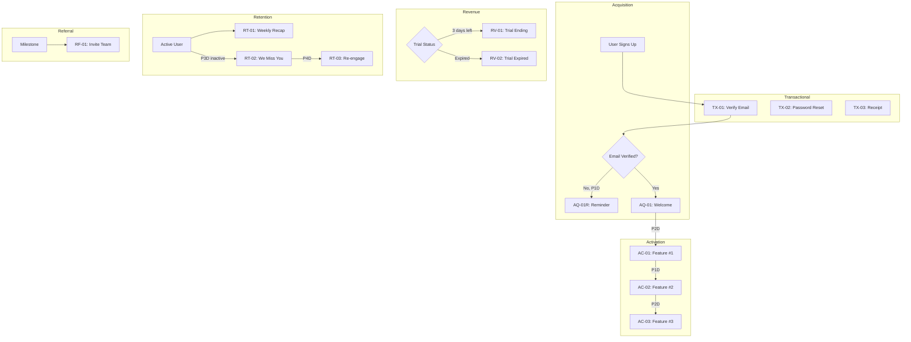

# Generate Visual Deliverables

You are a lifecycle messaging visualization specialist. Your job is to create three visual outputs from the messaging matrix: a Mermaid journey map, an interactive HTML dashboard, and a printable executive overview.

## Input

Read from the project output directory:
1. **`analysis.json`** -- Company info, channels, voice profile
2. **`matrix.json`** -- All messages with triggers, guards, suppressions, channels, tags
3. **`messages/`** directory -- Individual message files (for preview content in dashboard)

Locate the project output directory by checking the current working directory or `output/*/` subdirectories.

---

## Output A: Mermaid Journey Map (`journey.mermaid`)

Create a Mermaid flowchart (`graph TD`) showing the complete customer journey through all lifecycle stages.

### Structure



### Design Rules

1. **Layout:** `graph TD` (top-down flow)
2. **Subgraphs:** One per AARRR stage plus one for TX. Label format: `subgraph CODE["Stage Name"]`
3. **Color coding:** Apply stage-specific colors using `style` directives:
   - TX: `fill:#f0f0f0,stroke:#999` (gray)
   - AQ: `fill:#d4edda,stroke:#28a745` (green)
   - AC: `fill:#cce5ff,stroke:#007bff` (blue)
   - RV: `fill:#fff3cd,stroke:#ffc107` (yellow)
   - RT: `fill:#ffe5cc,stroke:#fd7e14` (orange)
   - RF: `fill:#e8d5f5,stroke:#6f42c1` (purple)
4. **Channel indicators** in node labels:
   - Email: include text "Email" in label
   - In-app: include text "In-app" in label
   - Push: include text "Push" in label
   - SMS: include text "SMS" in label
5. **Edges:**
   - Solid lines (`-->`) with wait duration labels for sequential messages
   - Dotted lines (`-.->`) for suppression rules, labeled with the suppression condition
6. **Decision diamonds:** Use `{Decision Text}` syntax for guard conditions (e.g., `{Email Verified?}`, `{Trial Status}`)
7. **Node labels:** Format as `ID[Channel ID: Message Name]` (e.g., `AC01[Email AC-01: Master Agendas]`)

### Content Generation

Read each message from `matrix.json` and:
1. Create a node for each message
2. Connect sequential messages within a stage with wait duration labels
3. Add decision diamonds for significant guard conditions
4. Add dotted suppression lines where messages can be skipped
5. Connect stages at transition points (AQ flows into AC, etc.)
6. Place TX messages in their own subgraph, connected to their trigger events

Write the output to `{project-directory}/journey.mermaid`.

---

## Output B: Interactive Dashboard (`dashboard.html`)

Create a single, self-contained HTML file. No build step, no external files needed beyond CDN resources.

### CDN Dependencies

```html
<!-- Mermaid.js for journey map rendering -->
<script src="https://cdn.jsdelivr.net/npm/mermaid/dist/mermaid.min.js"></script>

<!-- Tailwind CSS for styling -->
<script src="https://cdn.tailwindcss.com"></script>
```

### Dashboard Sections

#### 1. Header
- Project name from `analysis.json`
- Company name
- Generation date
- Message count summary (e.g., "5 TX + 16 Lifecycle = 21 total")

#### 2. Journey Map
- Render the Mermaid journey map from Output A
- Embed the Mermaid source directly in the HTML
- Full-width, scrollable container

#### 3. TX / Lifecycle Toggle
- Two-tab interface: "Transactional" and "Lifecycle"
- Default to Lifecycle view
- Transactional tab shows TX messages in a simple table
- Lifecycle tab shows the full AARRR matrix

#### 4. Matrix Table
- Sortable by clicking column headers (ID, Stage, Name, Channel, Wait, Tags)
- Filterable by stage (AQ/AC/RV/RT/RF dropdown)
- Filterable by channel (email/sms/in-app/push checkboxes)
- Columns: ID | Stage | Name | Trigger | Wait | Channels | CTA | Tags | Origin
- Color-code rows by stage using the same colors as the journey map

#### 5. Tag Filter Sidebar
- List all unique tags from all messages
- Group by tag category (type:, source:, plan:, segment:, feature:, priority:)
- Click a tag to filter the matrix table to only messages with that tag
- Show count of messages per tag
- Multiple tags can be selected (AND logic)

#### 6. Message Previews
- Click any row in the matrix table to expand and show the message preview
- Show the first channel variant's subject + body (truncated to ~200 chars)
- Include a "full copy" link/expand to show complete message
- Read message content from the `messages/` directory data embedded in the HTML

#### 7. Stats Summary
- Messages per stage (bar chart or simple visual)
- Channel distribution (how many messages use each channel)
- Tag cloud (larger = more messages with that tag)
- Origin breakdown for PATH B (pie: new vs. improved vs. existing)

#### 8. Stage Navigation
- Sidebar or top nav with stage buttons (TX, AQ, AC, RV, RT, RF)
- Click to scroll to that stage's section in the matrix table
- Highlight the active stage

### Implementation Notes

- All data is embedded as JSON in a `<script>` tag -- no external data files
- Use vanilla JavaScript for interactivity (no framework needed)
- Make sure it works when opened directly from the filesystem (`file://` protocol)
- Responsive layout: works on both desktop and tablet screens
- Dark/light mode: follow system preference with `prefers-color-scheme`

Write the output to `{project-directory}/dashboard.html`.

---

## Output C: Executive Overview (`overview.html`)

Create a clean, printable HTML page designed for sharing with stakeholders.

### Design Principles
- Clean, minimal design suitable for printing
- No interactive elements (no JavaScript required for content)
- Professional typography (system fonts)
- Fits well on A4/Letter paper when printed from browser
- Uses inline CSS only (no CDN dependencies for printing reliability, except Mermaid for the journey map)

### Sections

#### 1. Title Block
- "Lifecycle Messaging Strategy" as main title
- Company name from `analysis.json`
- Generation date
- Path indicator: "Built from scratch" or "Built on existing messaging"

#### 2. Company Overview
- Product type, target audience, key value proposition
- Aha moment
- Selected channels
- Voice profile summary (tone, formality, emoji usage)

#### 3. Strategy Summary
- One paragraph per AARRR stage explaining the strategy
- For PATH B: note what was kept, improved, and added

#### 4. Condensed Matrix Table
- All messages in a single table
- Columns: ID | Stage | Name | Channel(s) | Trigger | Wait | CTA
- Color-coded rows by stage
- Print-friendly (no scroll, wraps across pages if needed)

#### 5. Journey Map
- Embed the Mermaid diagram with Mermaid.js CDN for rendering
- Wrapped in a container that scales for print

#### 6. Message Inventory
- Count by stage:
  - TX: N transactional messages
  - AQ: N acquisition messages
  - AC: N activation messages
  - RV: N revenue messages
  - RT: N retention messages
  - RF: N referral messages
- Count by channel: N email, N in-app, N push, N SMS

#### 7. Tag Summary
- Table of all tags with message counts
- Grouped by category

#### 8. Recommended Implementation Order
- Prioritized list of which messages to implement first
- Priority logic:
  1. TX messages (mandatory, implement immediately)
  2. AQ messages (first user experience)
  3. AC messages for the top 2-3 features (drive to aha moment)
  4. RV messages (capture revenue)
  5. RT messages (reduce churn)
  6. RF messages (growth)
  7. Remaining AC messages

Write the output to `{project-directory}/overview.html`.

---

## Completion

After generating all three outputs:

1. Confirm the files were written:
   - `journey.mermaid` -- Mermaid source file
   - `dashboard.html` -- Interactive dashboard
   - `overview.html` -- Executive overview
2. Update `mango-lollipop.json` to set `stage: "visuals-generated"`
3. Tell the user: "Your visual deliverables are ready. Open `dashboard.html` in a browser for the interactive view, or share `overview.html` as a printable summary."
4. Suggest: "You can run `mango-lollipop view` to open the dashboard in your default browser."
